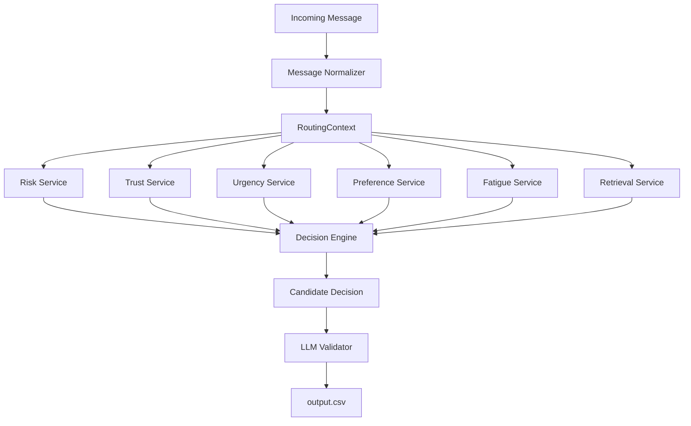

# Message Notification Router

## Hybrid AI Notification Routing System

### Features
- Personalized routing
- BM25 evidence retrieval
- Hybrid deterministic + LLM
- OCR
- ASR
- Explainability

### Architecture Diagram



### Pipeline

```text
Incoming Message
↓
Normalizer
↓
RoutingContext
↓
Feature Services
↓
Decision Engine
↓
LLM Validator
↓
output.csv
```

### Tech Stack
- Python
- Pandas
- BM25
- Gemini
- OCR
- ASR

### Running

```bash
pip install -r requirements.txt
python code/main.py
```
