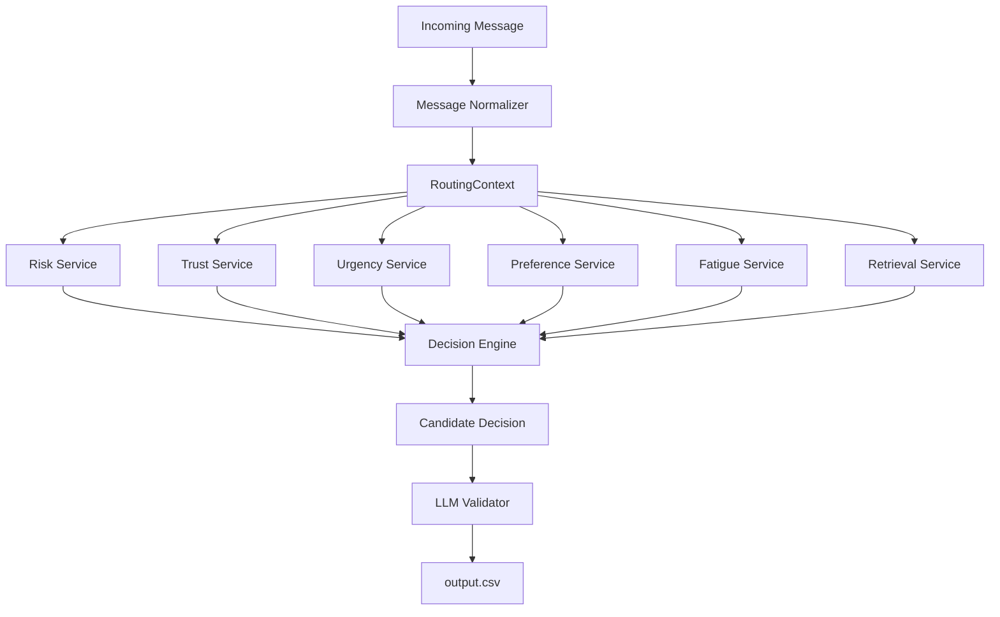

# Message Notification Router

**A production-oriented, hybrid AI notification routing architecture.**

This system acts as an intelligent traffic controller for incoming messages, utilizing a modular pipeline of deterministic feature services paired with an LLM validation layer to decide whether a message should `notify` the user immediately, `digest` for later, or `mute` entirely.

---

## 🌟 Key Features

- **Personalized Routing:** Evaluates individual user fatigue, muted groups, and promotion preferences.
- **BM25 Evidence Retrieval:** Dynamically retrieves historical messages to provide context-aware evidence for decision-making.
- **Multimodal Support (OCR & ASR):** Seamlessly extracts text from images and voice notes, routing them through the same core pipeline as text messages.
- **Hybrid Architecture:** Relies on fast, deterministic heuristics for objective signals (risk, urgency) and reserves LLMs strictly for high-level validation.
- **Absolute Explainability:** Every decision produces a calibrated confidence score and a concise reason detailing exactly which feature services influenced the outcome.

---

## 🏗️ Architecture Diagram



---

## ⚙️ How the Pipeline Works

1. **Message Normalizer:** Every incoming message—whether text, an image poster, or a voice note—is normalized into a unified textual representation. This allows downstream services to remain modality-agnostic.
2. **RoutingContext Construction:** The system hydrates an immutable `RoutingContext` with user metadata, group details, business relationships, and historical interactions.
3. **Feature Services:** Independent, deterministic services compute objective signals:
   - **Risk Service:** Detects phishing, domain mismatches, and high user reports.
   - **Trust Service:** Evaluates verified business status and relationship longevity.
   - **Urgency Service:** Parses time-sensitive keywords.
   - **Preference & Fatigue Services:** Checks for DND status, notification limits, and muted groups.
   - **Retrieval Service:** Uses a lexical BM25 index to find relevant historical messages.
4. **Decision Engine:** Fuses the objective signals to produce a **Candidate Decision** (`notify`, `digest`, or `mute`), assigns a classified `message_type`, and bounds the confidence level.
5. **LLM Validator:** Consumes the structured Candidate Decision JSON and verifies it. It acts purely as a safety mechanism, ensuring the system validates reasoning rather than recomputing deterministic signals.

---

## 🛡️ Design Principles & Trade-offs

- **Explainability over opacity:** We use deterministic feature engineering before probabilistic LLM reasoning.
- **Why BM25 over Embeddings?** Embedding retrieval was intentionally deferred because BM25 provides deterministic, low-latency evidence retrieval suitable for rapid lexical lookups without the overhead of maintaining an embedding infrastructure.
- **Graceful Degradation:** The pipeline handles failures robustly. If OCR/ASR fails, it falls back to raw text. If the LLM is unavailable, it relies strictly on the deterministic candidate decision. High-risk signals ALWAYS override personalization.

---

## 💻 Tech Stack

- **Core:** Python 3.11
- **Data Processing:** Pandas, NumPy
- **Retrieval Engine:** Custom Pure-Python BM25
- **Validation Layer:** Stubbed LLM integration
- **Multimodal Extraction:** Stubbed OCR and ASR integrations

---

## 🚀 Running the Pipeline

### Prerequisites
Ensure you have Python 3.10+ installed.

### Installation
Install the required dependencies from the root directory:
```bash
pip install -r requirements.txt
```

### Execution
Run the orchestrator against the dataset to generate `output.csv` in the root directory:
```bash
python code/main.py
```

*Note: You can run `python code/main.py --eval` to test the pipeline against the smaller `sample_messages.csv` and view evaluation metrics.*
